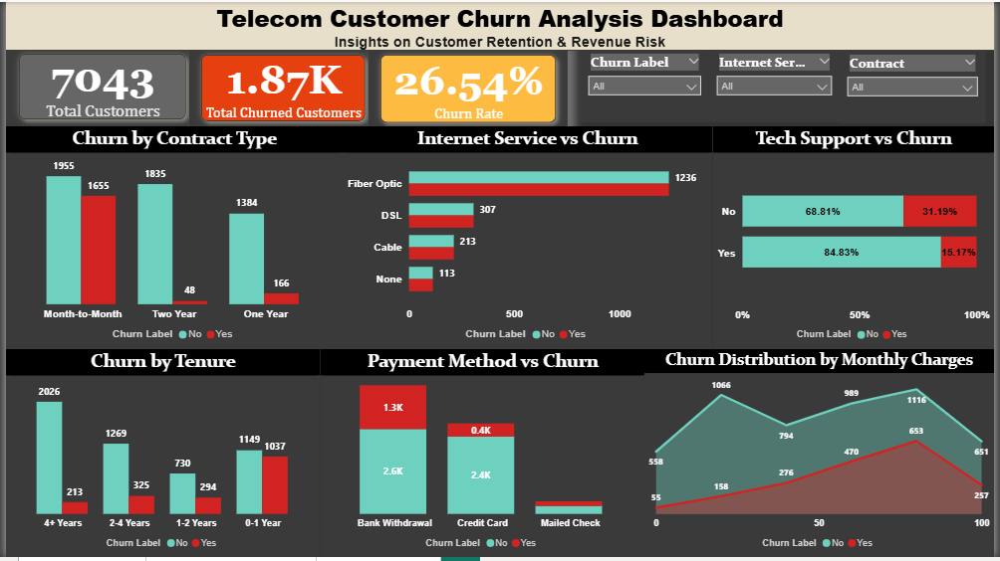
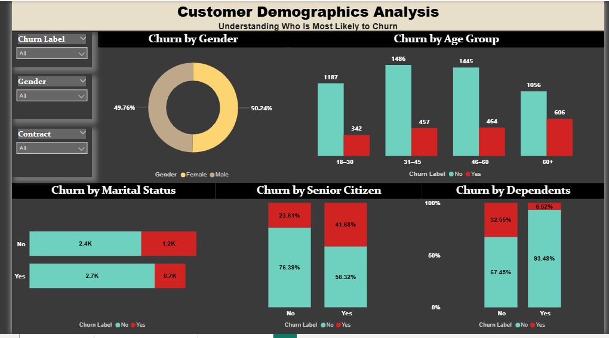
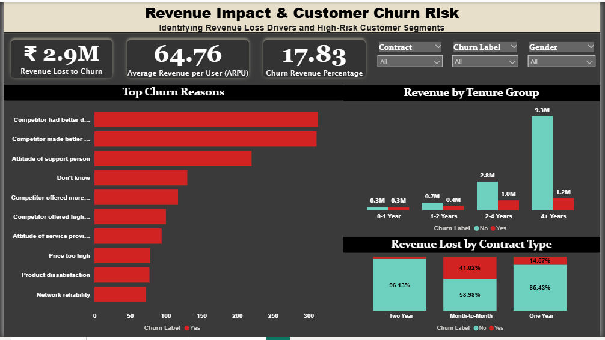

 # 📊 Telecom Customer Churn Analysis

## 📌 Problem Statement
Customer churn is a critical challenge in the telecom industry, where customers frequently switch service providers due to competitive pricing, service quality, or better offers. High churn rates directly impact revenue and business growth.

This project aims to analyze telecom customer data to identify key factors driving churn and provide actionable insights to improve customer retention and business decision-making.

---

## 📂 Dataset
- **Source:** IBM Telco Customer Dataset  
- **Total Records:** 7,000+ customers  
- **Description:** Includes customer demographics, service subscriptions, account details, and churn status  

---

## 🛠 Tools & Technologies
- **Power BI** – Data cleaning, transformation, and dashboard development  

---

## 📊 Key Analysis Performed
- Calculated overall **churn rate**
- Analyzed churn by **contract type**
- Evaluated churn across **internet service categories**
- Performed **customer segmentation based on tenure**
- Analyzed **monthly charges vs churn behavior**
- Studied impact of **payment methods on churn**

---

## ⚠️ Challenges Faced & Solutions

### 1️⃣ Data Quality Issues
- **Problem:** Missing and inconsistent values in columns like *TotalCharges*  
- **Solution:** Cleaned and transformed data using Power Query to ensure accuracy  

---

### 2️⃣ Data Type Inconsistency
- **Problem:** Numeric columns stored as text  
- **Solution:** Converted to appropriate data types for accurate calculations  

---

### 3️⃣ Lack of Direct Business Indicators
- **Problem:** Dataset did not directly explain churn reasons  
- **Solution:** Created derived fields (e.g., tenure groups) to uncover hidden patterns  

---

### 4️⃣ Identifying Key Churn Drivers
- **Problem:** Multiple factors influencing churn made analysis complex  
- **Solution:** Used comparative visual analysis to isolate key drivers such as contract type, tenure, and pricing  

---
## 📸 Dashboard Screenshots

### Churn Overview

### Customer Demographics

### Revenue & Risk Analysis

---

## 🔍 Key Insights
- Around **26% of customers have churned**
- **Month-to-month contract customers** have the highest churn rate  
- Customers with **higher monthly charges** are more likely to churn  
- **New customers (low tenure)** show higher churn probability  
- **Fiber optic users** have higher churn compared to DSL users  

---

## 💡 Business Recommendations
- Promote **long-term contracts** to reduce churn  
- Offer **targeted discounts** for high monthly charge customers  
- Improve service quality for **high-risk customer segments**  
- Focus retention strategies on **new customers**

---

## 🚀 Business Impact
This project simulates a real-world telecom analytics scenario where identifying high-risk customers enables companies to take proactive measures, reduce churn, and improve customer lifetime value.

---

## 📁 Project Structure

Telecom-Customer-Churn-Analysis
│
├── dataset/
├── dashboard/
├── README.md

---

## 🔗 Connect With Me
- **LinkedIn:** https://www.linkedin.com/in/saba-attar-9823aa183  
- **GitHub:** https://github.com/SabaAttar  
---

## 🚀 Conclusion
These dashboards help analyze customer churn patterns, uncover key drivers of attrition, and provide actionable insights to enhance customer retention strategies and minimize revenue loss.

--- 

## Author: SABA ATTAR
- Key Skills: MS Power BI, SQL, Tableau, MS Excel, Python etc..

⭐ If you found this project useful, feel free to star the repository!

